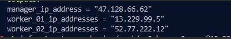
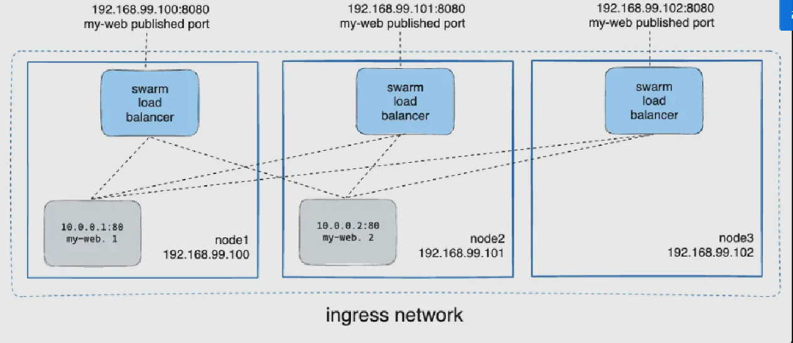
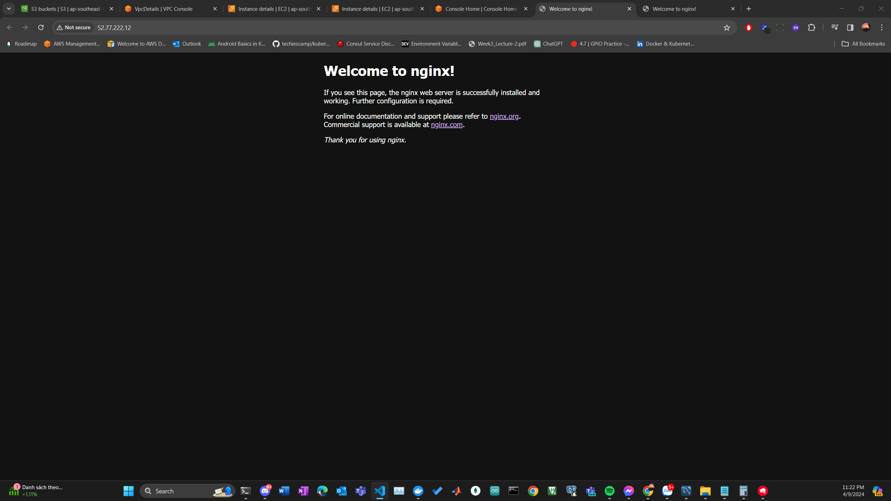
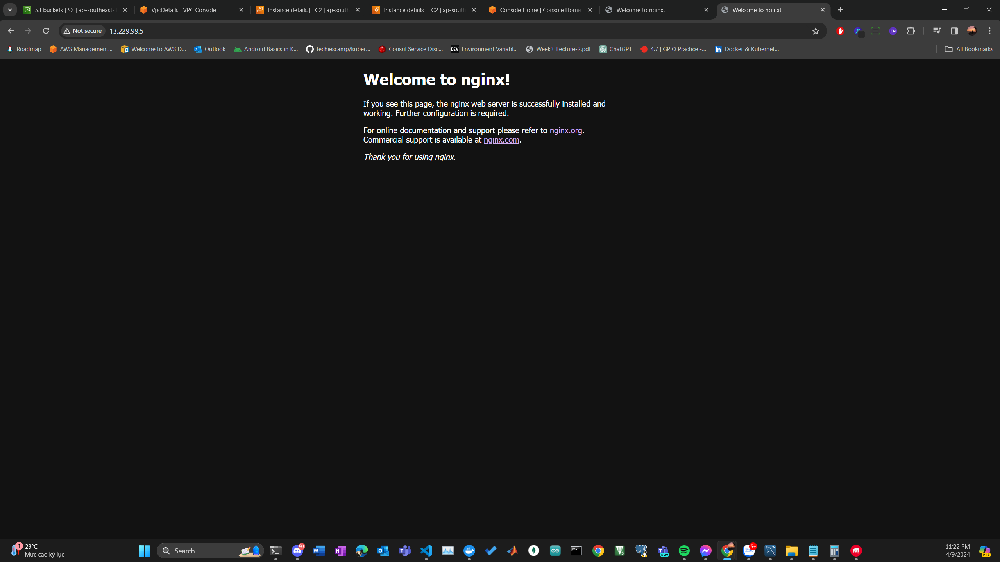

# Docker Swarm Demo

This repository contains code and instructions for setting up a Docker Swarm demo, based on the tutorial provided by Docker in their official documentation.

## Tutorial Source

The tutorial used for this demo can be found at [Docker Swarm Tutorial](https://docs.docker.com/engine/swarm/swarm-tutorial/).

## Overview

Docker Swarm is a clustering and orchestration tool for Docker containers, allowing you to manage a cluster of Docker hosts as a single virtual system. This tutorial provides a step-by-step guide to setting up and deploying a Docker Swarm.

## Node IP configuration

## Mode Routing Mesh Result 

